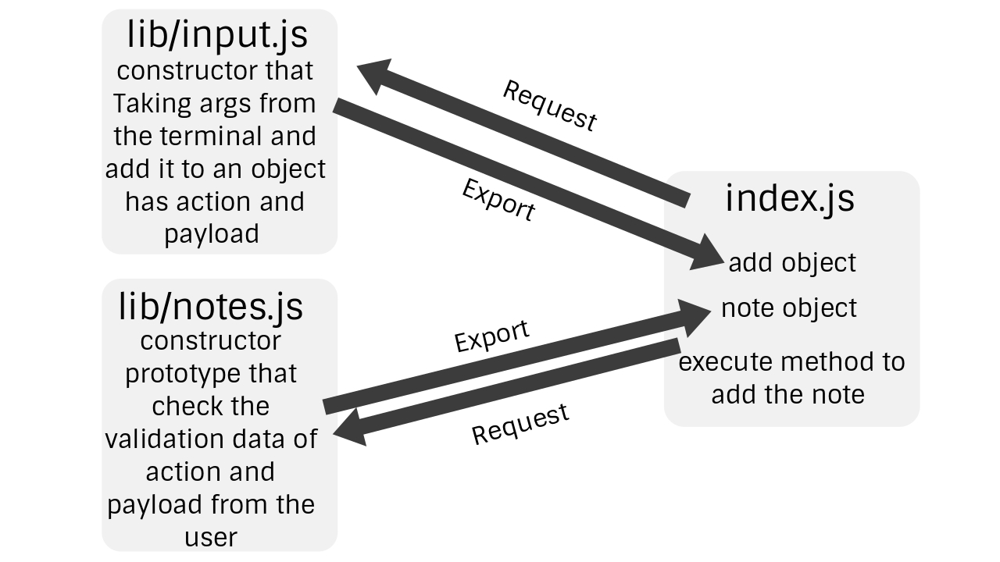
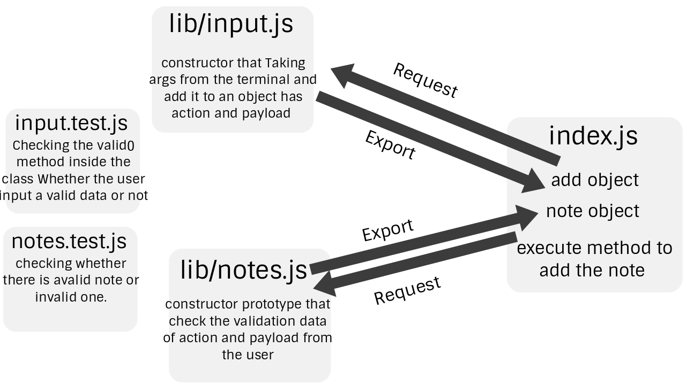
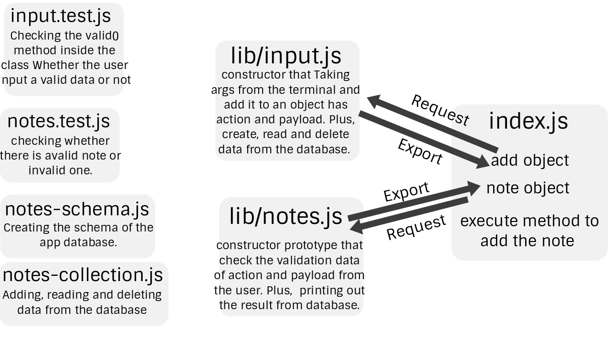

# Lab 01

## Node Ecosystem

### Author: Abdulrahman AL-Janabi

### Links and Resources
- [Submission PR](https://github.com/Janabi/notes/pull/1)

### Modules 
node.js

### Packages
- minimist
- generateUniqueId

**To run this application in your terminal, just use the following commands:**
- node index.js -a "some notes"
- node index.js --add "some notes"
- node index.js -ad "some notes"
- node index.js -a

***The last two command jsu to make sure that the user will add the right action and note.***

### UML

# Lab 02

## Classes, Inheritance, Functional Program

### Author: Abdulrahman AL-Janabi

### Links and Resources
- [Submission PR 1](https://github.com/Janabi/notes/pull/2)
- [Submission PR 2](https://github.com/Janabi/notes/pull/3)
- [Submission PR 3](https://github.com/Janabi/notes/pull/4)

### Modules 
node.js

### Packages
- minimist
- generateUniqueId
- jest
- jest-cli

**To run this application in your terminal, just use the following commands:**
- node index.js -a "some notes"
- node index.js --add "some notes"
- node index.js -ad "some notes"
- node index.js -a
- npm test
- npm run test

***The last two command jsu to make sure that the user will add the right action and note.***

### UML

# Lab 03

## Data Modeling & NoSQL Databases

### Author: Abdulrahman AL-Janabi

### Links and Resources
- [Submission PR](https://github.com/Janabi/notes/pull/5)

### Modules 
node.js

### Database
MongoDB

### Packages
- minimist
- generateUniqueId
- jest
- jest-cli
- mongoose
- supergoose

**To run this application in your terminal, just use the following commands:**
- node index.js -a "some notes"
- node index.js --add "some notes"
- node index.js -ad "some notes"
- node index.js -a
- node index.js -l
- node index.js --list
- node index.js -l school
- node index.js --list school
- node index.js -d "Type an id from any record in the database"
- node index.js --delete "Type an id from any record in the database"
- npm test
- npm run test

***The last two command jsu to make sure that the user will add the right action and note.***

### UML

# Lab 04

## Advanced Mongo/Mongoose

### Author: Abdulrahman AL-Janabi

### Links and Resources
- [Submission PR](https://github.com/Janabi/notes/pull/5)

### Modules 
node.js

### Database
MongoDB

### Packages
- minimist
- generateUniqueId
- jest
- jest-cli
- mongoose
- @code-fellows/supergoose

**To run this application in your terminal, just use the following commands:**
- node index.js -a "some notes"
- node index.js --add "some notes"
- node index.js -ad "some notes"
- node index.js -a
- node index.js -l
- node index.js --list
- node index.js -l school
- node index.js --list school
- node index.js -d "Type an id from any record in the database"
- node index.js --delete "Type an id from any record in the database"
- node index.js -u "Type an id from any record in the database" "Right here the new text"
- node index.js --update "Type an id from any record in the database" "Right here the new text"
- npm test
- npm run test

***The last two command jsu to make sure that the user will add the right action and note.***

### UML
